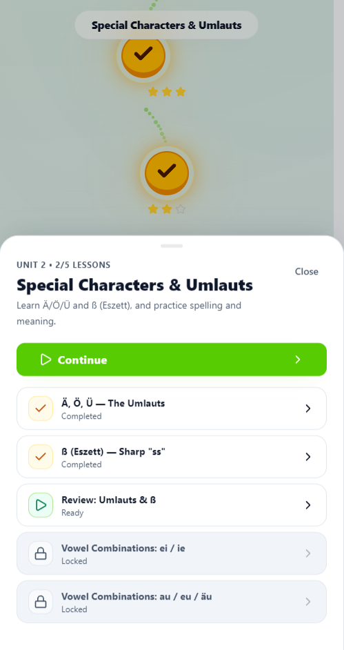
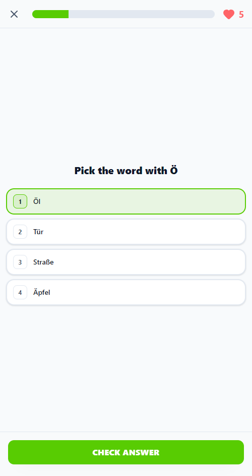
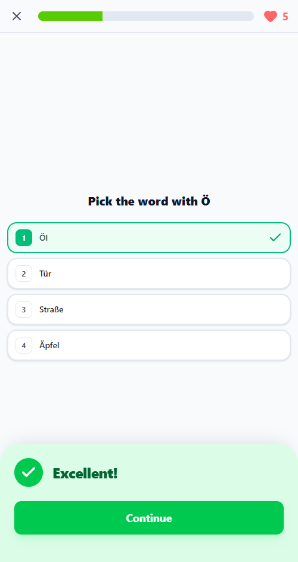
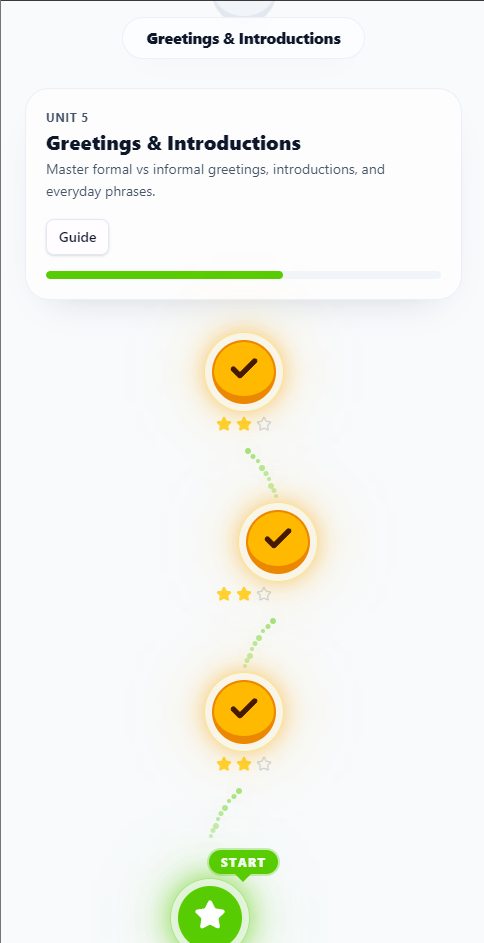

# 🇩🇪 German Mastery: A Universal Learning Engine

<p align="center">
  
</p>

<p align="center">
  <em>Note: Place a banner image at <code>public/screenshots/banner.png</code></em>
</p>

<p align="center">
  <a href="https://nextjs.org/">
    
  </a>
  <a href="https://www.typescriptlang.org/">
    
  </a>
  <a href="https://tailwindcss.com/">
    
  </a>
  <a href="https://supabase.com/">
    
  </a>
  <a href="https://web.dev/progressive-web-apps/">
    
  </a>
</p>

## 🚀 Overview

**German Mastery** is a next-generation learning platform designed to make mastering any subject engaging, interactive, and visually stunning. While currently configured for German, the underlying engine is **completely content-agnostic**, making it the perfect foundation for any language, science, or trivia learning application.

Built with a focus on user experience, it combines gamification principles with a robust curriculum structure to keep users motivated.

Unlike traditional learning apps, this engine focuses on:

- **Universal Applicability**: Easily adaptable for Spanish, French, Coding, History, or any other subject.
- **Immediate Feedback**: Real-time validation of answers with satisfying micro-interactions.
- **Visual Progression**: A dynamic "Candy Land" style map that visualizes the learning journey.
- **Immersion**: Native audio pronunciation support and context-rich exercises.
- **Accessibility**: A responsive, PWA-enabled design that works seamlessly across all devices.

## ✨ Key Features

### 🎮 Content-Agnostic Game Engine

At the core of the application is a flexible game engine that supports various exercise types for any data set:

- **Multiple Choice**: Fast-paced vocabulary or fact recognition.
- **Listen & Select**: Audio-focused challenges (great for languages or music).
- **Sentence Building**: Drag-and-drop sequencing (ideal for grammar or logic).
- **Fill in the Blanks**: Contextual practice.

### 🔑 Demo Access

Want to try it out? You can log in with this test account:

- **Email**: `demo@german-mastery.student`
- **Password**: `demo`

> **Note**: This is a public test environment. Data may be reset periodically.

### 🗺️ Visual Learning Path

Users navigate through a beautifully animated roadmap. Each node represents a lesson, unlocking sequentially as the user progresses. The path is dynamically generated and state-aware, showing completed (gold), active (pulsing), and locked (gray) states.

### 🏆 Progress & Rewards

- **Hearts System**: A lives-based system to encourage careful thought.
- **XP & Streaks**: Daily engagement tracking to build learning habits.
- **Confetti & Haptics**: Delightful rewards upon lesson completion aimed at maximizing dopamine release.

### 🔒 Admin Dashboard

A comprehensive admin interface allowing content creators to:

- Manage courses, units, and lessons.
- Create and edit exercises with a WYSIWYG-like experience.
- **Import/Export Content**: Easily swap out the German content for any other subject matter.

## 🛠️ Technology Stack

This project leverages the latest in modern web development to deliver a high-performance experience.

| Category       | Technology                  | Reason for Choice                                           |
| :------------- | :-------------------------- | :---------------------------------------------------------- |
| **Framework**  | **Next.js 16 (App Router)** | Server Components for performance, SEO, and robust routing. |
| **Language**   | **TypeScript**              | Strict type safety for maintainable and bug-free code.      |
| **Styling**    | **Tailwind CSS v4**         | Rapid UI development with a custom design system.           |
| **Animations** | **Framer Motion**           | Complex, physics-based animations for a "premium" feel.     |
| **State**      | **Zustand**                 | Lightweight, predictable global state management.           |
| **Backend**    | **Supabase**                | Scalable PostgreSQL database and secure authentication.     |
| **Testing**    | **Vitest & Playwright**     | Comprehensive unit and end-to-end testing reliability.      |
| **Components** | **Radix UI / Lucide**       | Accessible primitives and crisp iconography.                |

## 📸 Gallery

<table align="center">
  <tr>
    <td align="center" width="50%">
      
      <br>
      <em>Interactive Lessons</em>
    </td>
    <td align="center" width="50%">
      
      <br>
      <em>Instant Feedback</em>
    </td>
  </tr>
  <tr>
    <td align="center" width="50%">
      
      <br>
      <em>Visual Roadmap</em>
    </td>
    <td align="center" width="50%">
      
      <br>
      <em>Gamified Rewards</em>
    </td>
  </tr>
</table>

> <p align="center"><em>Images showcase the vibrant UI and interactive elements of the learning experience.</em></p>

## 🏁 Getting Started

### Prerequisites

- Node.js 18+
- npm or pnpm

### Installation

1.  **Clone the repository**

    ```bash
    git clone https://github.com/Amer-alsayed/Learn-German.git
    cd german-mastery
    ```

2.  **Install dependencies**

    ```bash
    npm install
    # or
    pnpm install
    ```

3.  **Set up Environment Variables**
    Create a `.env.local` file in the root directory and add your Supabase credentials:

    ```env
    NEXT_PUBLIC_SUPABASE_URL=your_supabase_url
    NEXT_PUBLIC_SUPABASE_ANON_KEY=your_supabase_anon_key
    ```

4.  **Run the development server**

    ```bash
    npm run dev
    ```

5.  Open [http://localhost:3000](http://localhost:3000) with your browser to see the result.

## 🤝 Contributing

Contributions make the open-source community an amazing place to learn, inspire, and create. Any contributions you make are **greatly appreciated**.

1.  Fork the Project
2.  Create your Feature Branch (`git checkout -b feature/AmazingFeature`)
3.  Commit your Changes (`git commit -m 'Add some AmazingFeature'`)
4.  Push to the Branch (`git push origin feature/AmazingFeature`)
5.  Open a Pull Request

---

<p align="center">
  Made with ❤️ by [Amer Alsayed]
</p>
